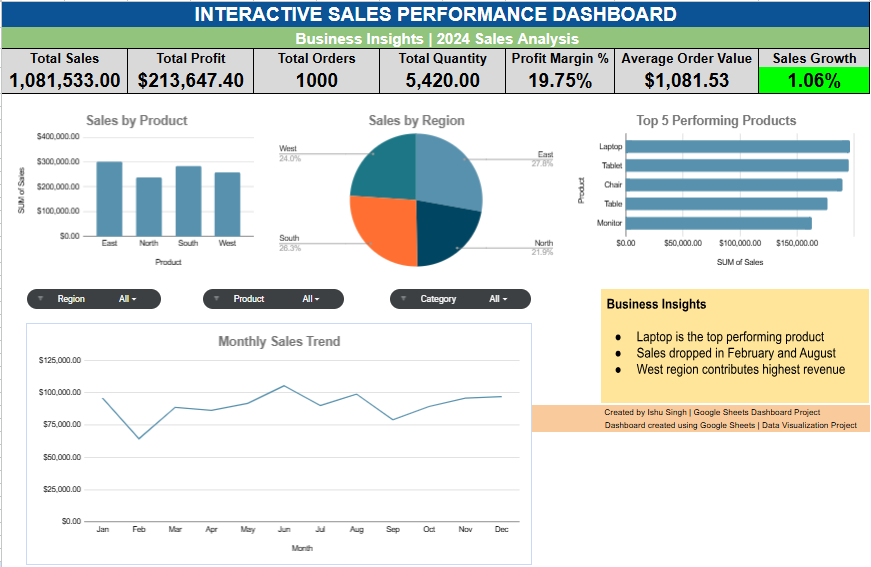

 # Sales Performance Dashboard (Google Sheets)

This project presents an interactive sales performance dashboard created using Google Sheets.

## Project Overview
The dashboard analyzes sales data and provides insights into product performance, regional sales distribution, and key business metrics.

## Key Metrics
- Total Sales
- Total Profit
- Total Orders
- Total Quantity
- Profit Margin %
- Average Order Value
- Sales Growth %

## Visualizations
- Sales by Product
- Sales by Region
- Top 5 Performing Products

## Tools Used
- Google Sheets
- Pivot Tables
- Data Visualization
- Dashboard Design

## Key Insights
- Sales performance varies across regions
- Certain products contribute the majority of revenue
- KPI metrics help monitor business growth

## Dashboard Preview

